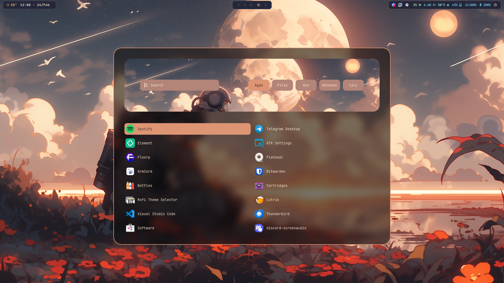
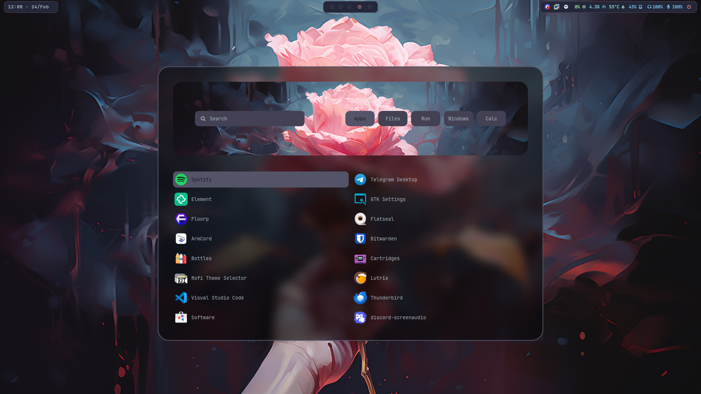
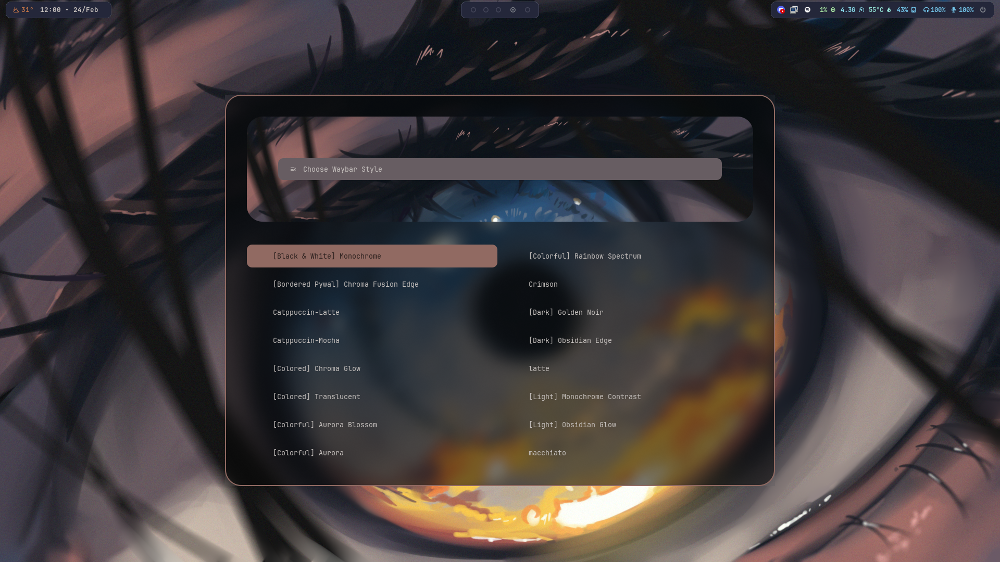
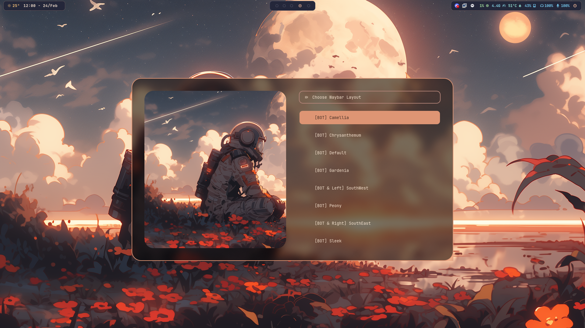
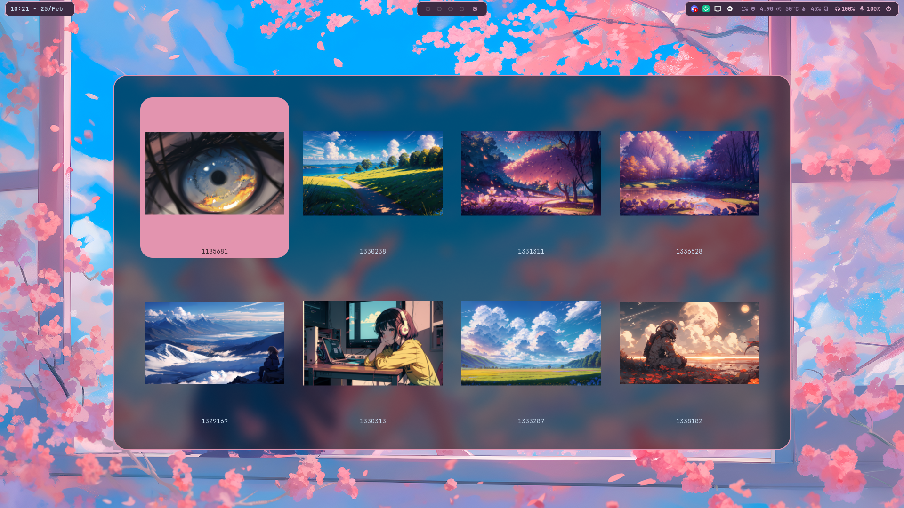

<h2 align="center">
    

  Dot files for my Fedora with Hyprland
</h2>

<h4 align="center">
  <a href="https://github.com/zDyanTB/HyprNova/blob/master/documentation.md">Check out the documentation!</a>
</h4>

>   [!Caution]
>   Requires [pywal](https://github.com/dylanaraps/pywal) to work

# Screenshots

 Rofi 

<h4 align="center"> Menu </h4>

  

<h4 align="center"> Waybar Layouts </h4>

<h4 align="center"> Wallpaper Selector </h4>

  
# TODO
- [ ] Switch to hylock-idle
- [ ] Add the rest of keybinds
- [ ] Adapt rofi and pywal colors when using animated images as wallpapers
- [ ] Make wallpaperSelect.sh recursive (look into subdirectories)
- [x] Add waybar dotfiles
- [x] Improve rofi color scheme
- [x] Adapt all rofi styles
- [x] Change wlogout layout to 3x2

# Thanks to
 - [JaKooLi](https://github.com/JaKooLit) for the scripts and dotfiles!
 - [adi1090x](https://github.com/adi1090x/rofi) themes ideias!
