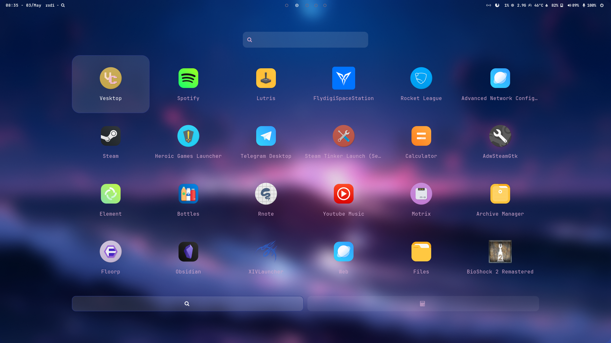
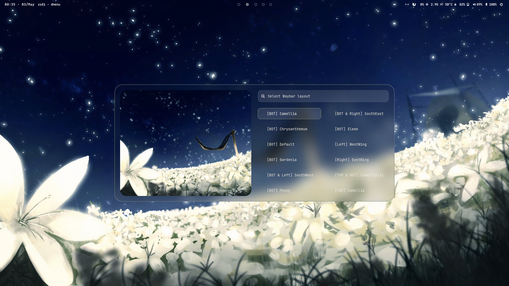
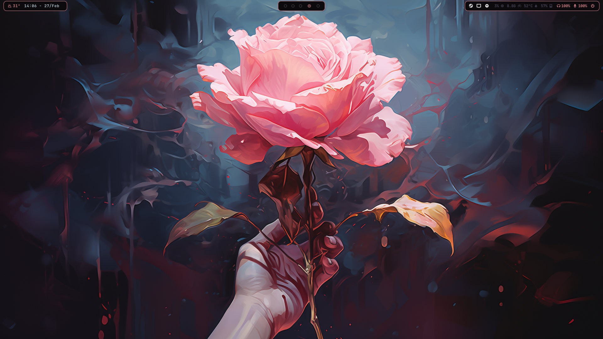
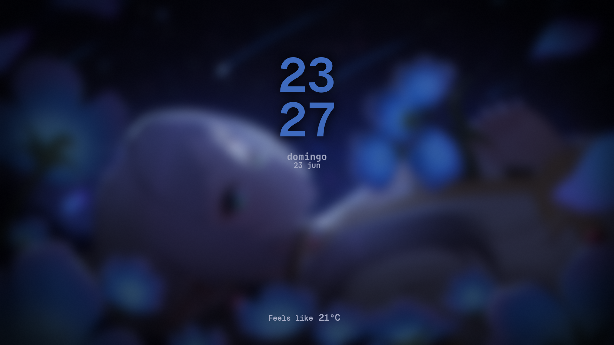
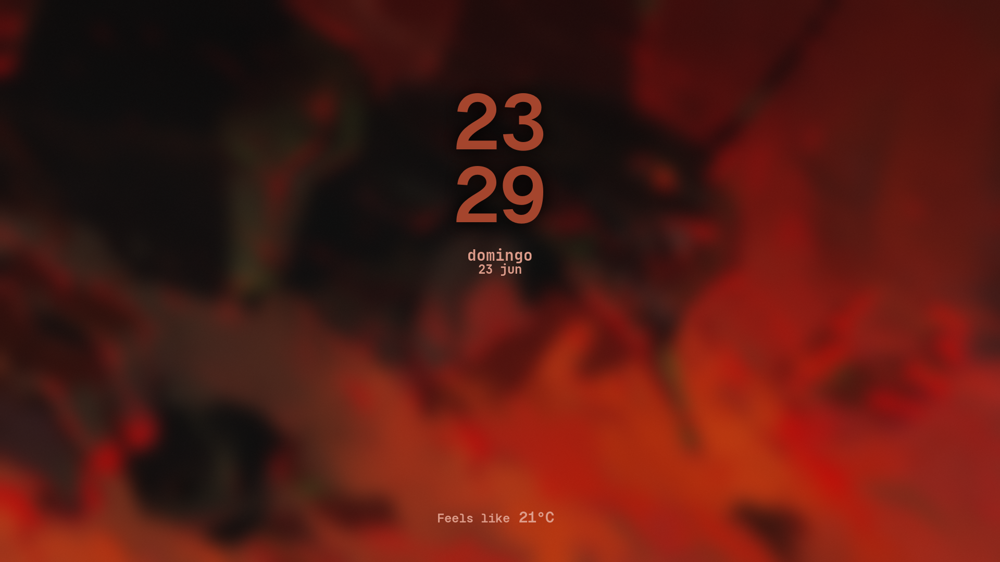
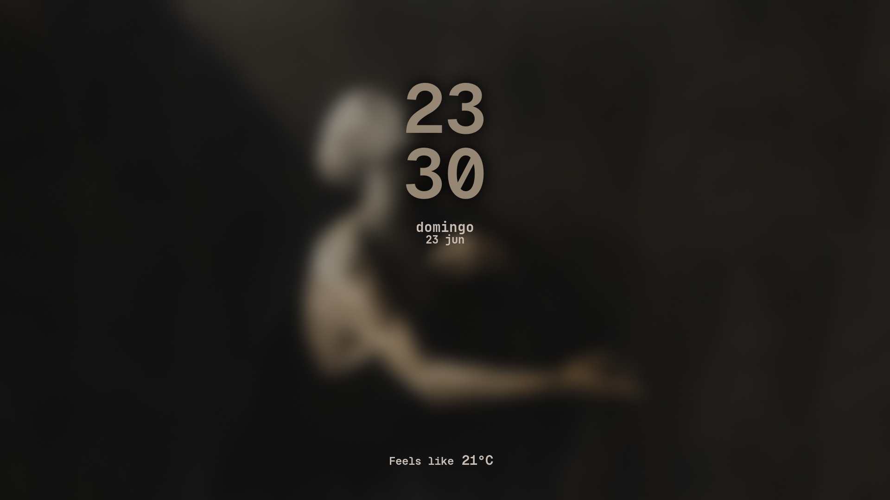
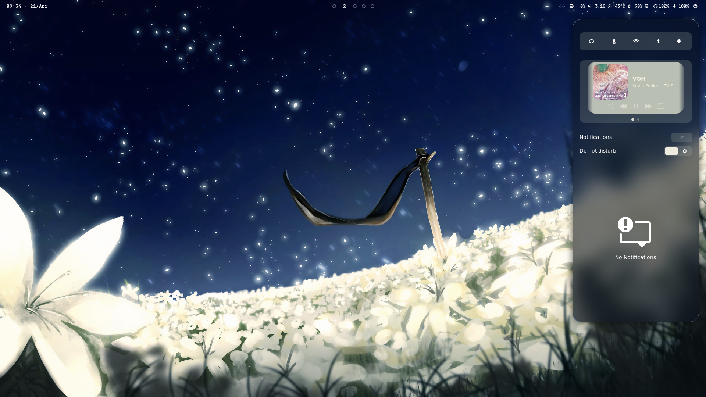
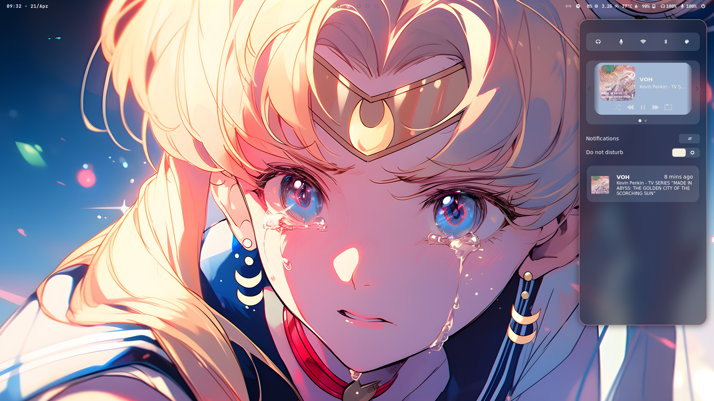
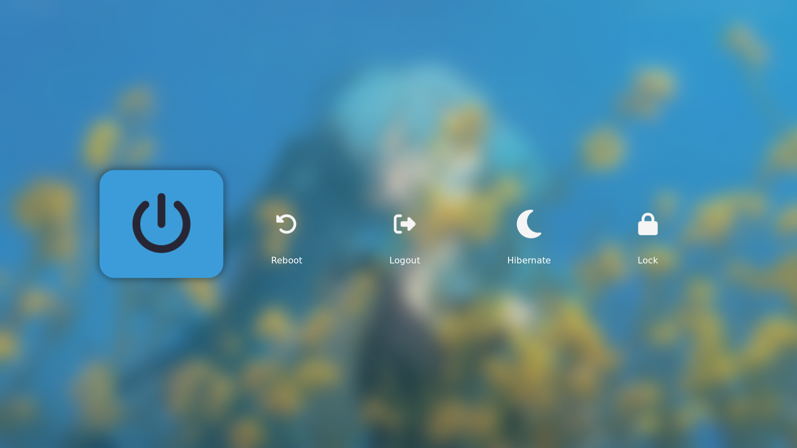

<h2 align="center">
    
  HyprNova for Hyprland
</h2>

<h3 align="center">
  A concise and astonishing config
</h3>

<h4 align="center">
  <a href="https://github.com/zDyanTB/HyprNova/blob/master/documentation.md">Check out the documentation!</a>  
  
  <a href="https://github.com/zDyanTB/aesthic-wallpapers">My wallpapers!</a>
  </h4>

>   [!Caution]
>   Requires [pywal](https://github.com/dylanaraps/pywal) to work

<h3 align="center">
	
	1.0 is Out!
	
</h3>

# Features
- Fully pywal integrated
- All-in-one setup
- Easy to use
- Concise

# Screenshots

  
  Rofi

<h4 align="center"> Menu </h4>

<h4 align="center"> Waybar Changer </h4>

<h4 align="center"> Wallpaper Selector </h4>

<h4 align="center"> Clipboard </h4>

 
  
  Waybar

  
  Hyprlock

  

  
  Swaync

  
  Wlogout

  

# TODO

- [ ] Switch to Matugen (or Wallust)
- [ ] Tweak swaync mpris cover background
- [ ] Branch old rofi

# Progress
- [x] Hyprland
- [x] Hyprlock
- [X] Rofi
- [x] Waybar
- [x] Swaync
- [x] Wlogout

# Thanks to
 - [JaKooLit](https://github.com/JaKooLit) for the scripts and dotfiles!
 - [adi1090x](https://github.com/adi1090x/rofi) themes ideias!
