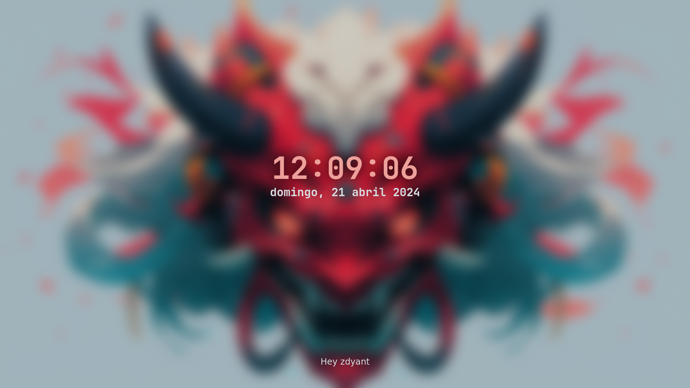
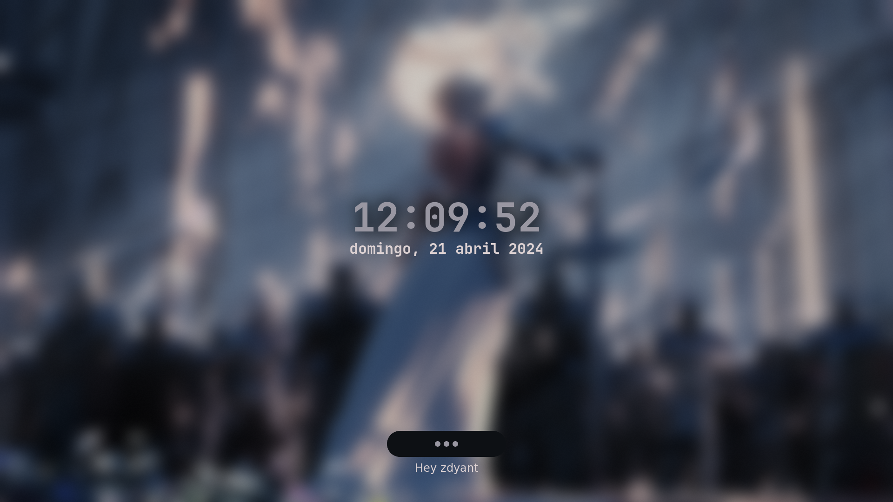
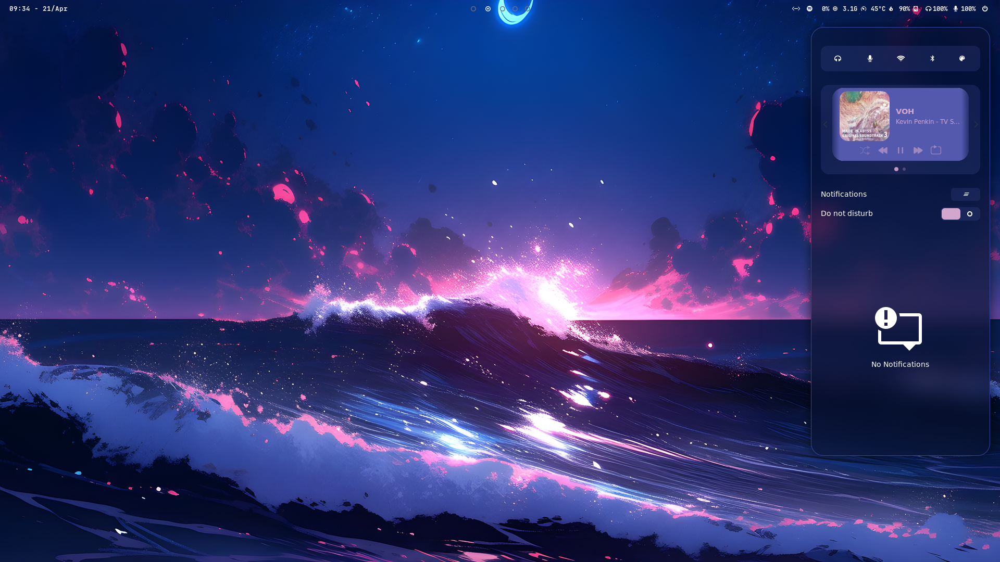
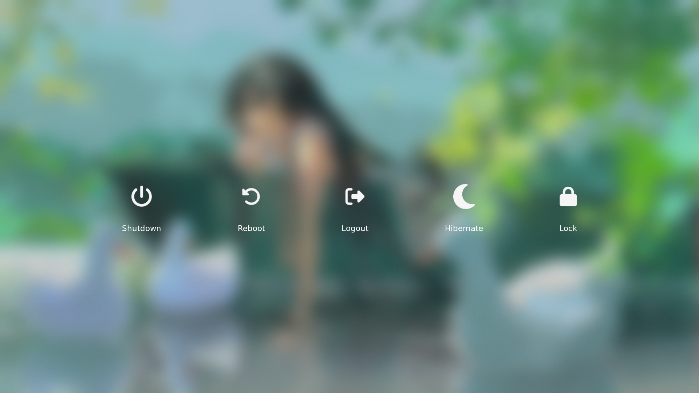
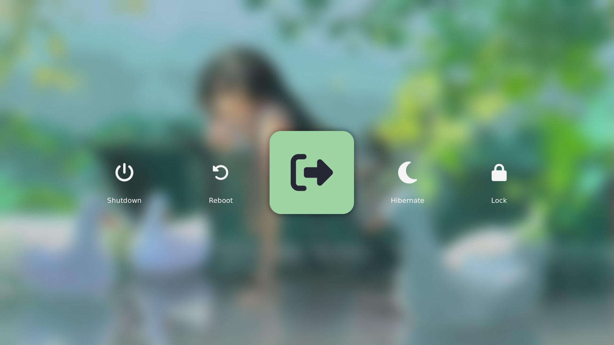
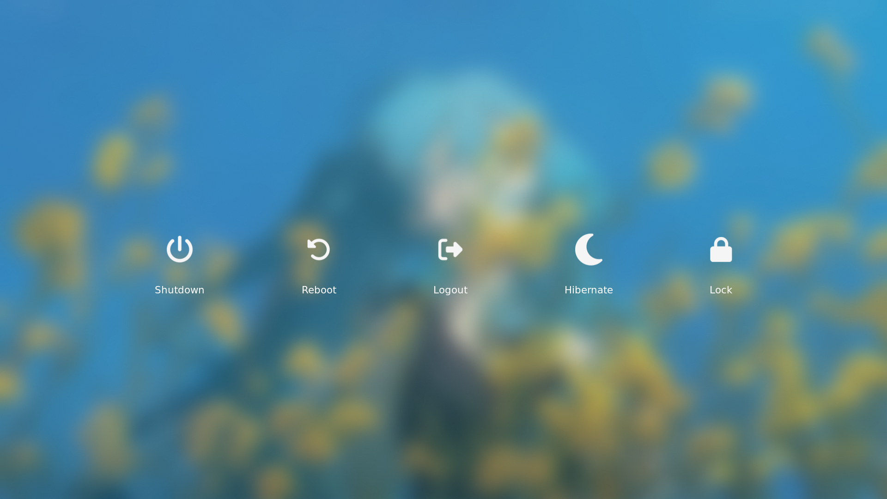

<h2 align="center">
    
  Dot files for my Fedora with Hyprland
</h2>

<h3 align="center">
  A concise and astonishing config
</h3>

<h4 align="center">
  <a href="https://github.com/zDyanTB/HyprNova/blob/master/documentation.md">Check out the documentation!</a>  
  
  <a href="https://github.com/zDyanTB/aesthic-wallpapers">My wallpapers!</a>
  </h4>

>   [!Caution]
>   Requires [pywal](https://github.com/dylanaraps/pywal) to work

>   [!Important]
>   1.0 Coming!

# Features
- Fully pywal integrated

# Screenshots

  
  Rofi

<h4 align="center"> Menu </h4>

  

<h4 align="center"> Waybar Layouts </h4>

<h4 align="center"> Wallpaper Selector </h4>

 
  
  Waybar

  
  Hyprlock

  

  
  Swaync

  
  Wlogout

  

# TODO

- [ ] Adapt hyprlock theming to fit the wallpaper
- [ ] Adapt swaync icons
- [ ] Adapt rofi and pywal colors when using animated images as wallpapers
- [ ] Tweak swaync mpris cover background

# Progress
- [x] Hyprland
- [x] Hyprlock
- [ ] Rofi
- [x] Waybar
- [x] Swaync
- [x] Wlogout

# Thanks to
 - [JaKooLi](https://github.com/JaKooLit) for the scripts and dotfiles!
 - [adi1090x](https://github.com/adi1090x/rofi) themes ideias!
